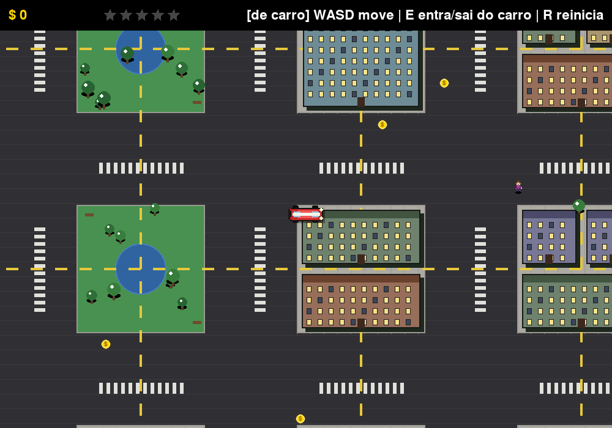
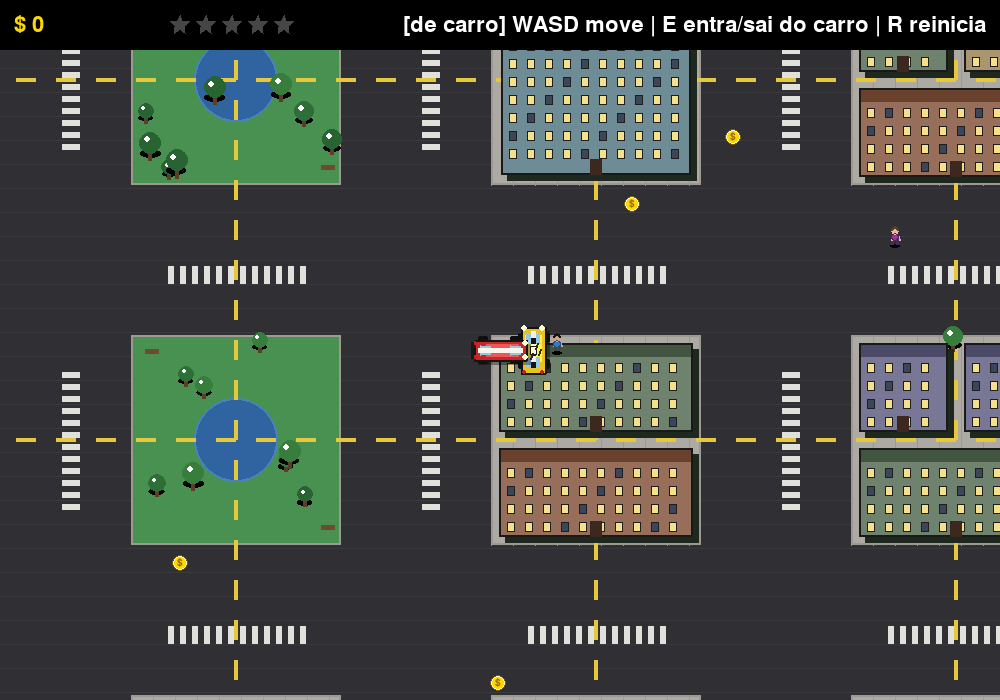

# Open City

Um jogo **top-down de ação em mundo aberto**, inspirado no gênero popularizado
por GTA, escrito **do zero em Python + [Pygame](https://www.pygame.org/)**.

> Este é um projeto original e independente, feito para estudo e portfólio.
> Não reproduz, usa assets de, ou é afiliado a nenhum jogo comercial.



## Destaques

- **Cidade gerada proceduralmente**: quarteirões variados (prédios, parques,
  praças, lagos, estacionamentos e um marco/landmark tipo estádio), conectados
  por uma malha de ruas largas com cruzamentos e faixas de pedestre.
- **Tráfego com IA própria**: dezenas de carros de 6 arquétipos visuais
  diferentes (sedã, táxi, "fusca", esportivo, picape, van) circulando pelas
  ruas, freando uns para os outros e virando nas esquinas.
- **Física de colisão entre veículos**: carros se empurram e ricocheteiam ao
  se tocar; batidas fortes deixam o carro civil "batido" e, pouco depois, seu
  motorista desce para checar o estrago antes de seguir a pé pela cidade.
- **Pedestres animados**: caminham pela cidade com pernas e braços em
  movimento; ao serem atropelados, reagem com um efeito estilo *ragdoll*
  (voam, rolam e derrapam pelo chão) e deixam sangue no chão.
- **Alternância carro/a pé**: saia do carro a qualquer momento para andar a
  pé, ou entre no carro mais próximo.
- **Nível de procurado**: atropelar pedestres chama a polícia, que persegue o
  jogador (de carro ou a pé) até prendê-lo ou até o nível de procurado cair.



## Como rodar

```bash
# 1. crie e ative um ambiente virtual (recomendado)
python3 -m venv .venv
source .venv/bin/activate        # Windows: .venv\Scripts\activate

# 2. instale as dependências
pip install -r requirements.txt

# 3. rode o jogo
python main.py
```

Também é possível rodar como módulo, ou instalar o pacote e usar o comando
`open-city` diretamente:

```bash
python -m open_city

# ou, instalando o pacote:
pip install -e .
open-city
```

### Controles

| Tecla            | Ação                                   |
| ---------------- | --------------------------------------- |
| `W A S D` / setas | Dirigir (de carro) ou andar (a pé)     |
| `Espaço`          | Freio de mão (só de carro)             |
| `E`               | Sair do carro / entrar no carro mais próximo |
| `R`               | Reiniciar a partida                    |
| `Esc`             | Sair do jogo                           |

## Estrutura do projeto

O código é organizado em pacotes por responsabilidade, para ficar fácil de
navegar e de estender:

```
open_city/
├── main.py                    # ponto de entrada (python main.py)
├── pyproject.toml             # empacotamento + configuração do pytest
├── requirements.txt           # dependências de runtime
├── requirements-dev.txt       # + dependências de desenvolvimento (pytest)
│
├── open_city/                 # pacote principal do jogo
│   ├── __init__.py            # expõe `Game` no nível do pacote
│   ├── __main__.py            # permite `python -m open_city`
│   ├── cli.py                 # função `run()` usada pelo console-script
│   ├── settings.py            # constantes globais (tela, mundo, ruas)
│   ├── palette.py             # cores e arquétipos visuais (carros, roupas)
│   │
│   ├── utils/                 # utilitários genéricos
│   │   └── geometry.py        # clamp, rotação de pontos
│   │
│   ├── world/                 # geração e desenho do mundo
│   │   └── city.py            # classe City: quarteirões, ruas, locais especiais
│   │
│   ├── entities/               # "coisas vivas" do mundo
│   │   ├── vehicle.py          # classe Vehicle (jogador, tráfego, polícia)
│   │   └── pedestrian.py       # classe Pedestrian + máquina de estados
│   │
│   └── core/                   # laço principal do jogo
│       ├── game.py             # classe Game: orquestra tudo
│       ├── traffic.py          # IA do tráfego civil (mixin)
│       ├── collisions.py       # colisão física entre veículos (mixin)
│       ├── police.py           # spawn e perseguição da polícia (mixin)
│       └── hud.py              # desenho da interface (mixin)
│
├── tests/                      # suíte de testes automatizados (pytest)
│   ├── conftest.py             # força o driver de vídeo "dummy" (headless)
│   ├── test_geometry.py
│   ├── test_city.py
│   ├── test_vehicle.py
│   ├── test_pedestrian.py
│   └── test_game_smoke.py
│
└── docs/
    └── screenshots/
```

### Por que essa organização?

- **`settings.py` e `palette.py`** ficam separados da lógica: são só dados,
  fáceis de ajustar (ou testar) sem tocar em nenhuma classe.
- **`world`, `entities` e `core`** separam claramente "onde as coisas
  acontecem" (o mundo), "o que existe nele" (entidades) e "o que faz o jogo
  rodar" (o laço principal).
- Dentro de `core`, a classe `Game` é composta a partir de **mixins
  temáticos** (`TrafficMixin`, `CollisionMixin`, `PoliceMixin`, `HudMixin`).
  Cada um cuida de um assunto só (tráfego, colisão, polícia, HUD), mas todos
  compartilham o mesmo estado de partida - o que evita tanto um único
  arquivo gigante quanto uma sopa de objetos passando estado uns para os
  outros.

## Testes

O projeto tem uma suíte de testes automatizados com `pytest`, incluindo
testes unitários (geometria, geração do mundo, colisão, máquina de estados
dos pedestres) e um teste de "fumaça" que roda o laço principal do jogo por
vários quadros para pegar erros de integração entre os módulos.

```bash
pip install -r requirements-dev.txt
pytest
```

Os testes rodam em modo *headless* (sem abrir uma janela de verdade), então
funcionam normalmente em CI/containers.

## Roadmap / possíveis próximos passos

- [ ] Missões simples (entregar algo, corrida contra o tempo)
- [ ] Som (motor, buzina, sirene, atropelamento)
- [ ] Salvar recorde de dinheiro entre partidas
- [ ] Minimapa no HUD
- [ ] Empacotar como executável (PyInstaller) para rodar sem precisar de Python instalado

## Licença

Distribuído sob a licença MIT - veja [LICENSE](LICENSE).
